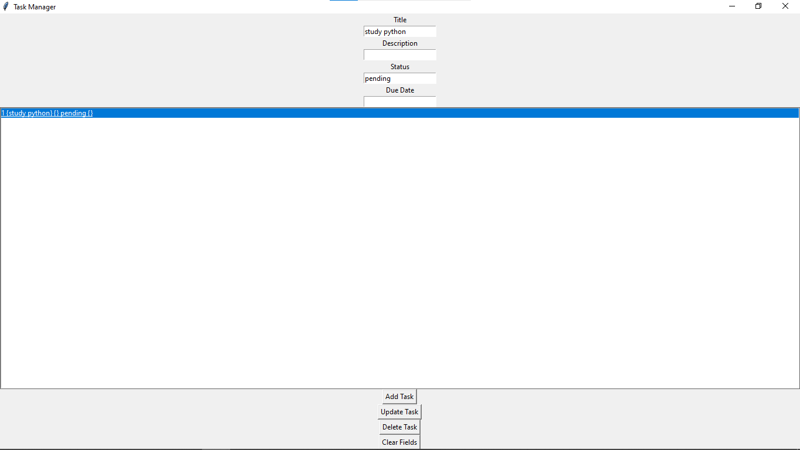

# 🚀 Task Management System (Python + SQLite + Tkinter)

## 💡 About the Project
This is a task management application developed using Python with a graphical user interface (GUI). The system allows users to organize and manage tasks in a simple and efficient way.

## 🛠️ Technologies Used
- Python
- SQLite
- Tkinter

## ⚙️ Features
- Add new tasks
- View all tasks
- Update existing tasks
- Delete tasks
- Interactive graphical interface

## 📷 Demo

## ▶️ How to Run
1. Install Python
2. Run the following command:

python main.py

## 🧠 Skills Demonstrated
- CRUD operations (Create, Read, Update, Delete)
- Database integration with SQLite
- GUI development with Tkinter
- Problem-solving and logical thinking

## 🎯 Objective
This project was developed to practice backend development, database management, and user interface creation, simulating a real-world task management system.

## 🚀 Future Improvements
- Add task filtering (by status or date)
- Improve UI/UX design
- Implement user authentication
- Convert to web application (Flask/Django)

---

⭐ Feel free to explore, use, and improve this project!
